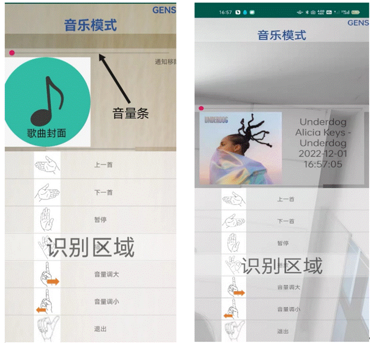

### 1.1编写目的

随着移动设备上支持的交互方式不断增加，在新冠疫情的影响下，社会对于公共场所中的无接触交互方式产生了巨大的需求。我们因此设计了使用空中交互方式的音乐控制应用程序，旨在帮助用户在必要的场景下使用空中交互方式进行音乐的相关操作。设计的音乐应用程序包含了播放、暂停、上下一曲切换在内的对音乐的常用操作。对于在安卓移动设备上安装了Music Control安卓应用程序的用户，我们的操作手册旨在使用户快速熟悉操作界面，认识应用程序使用的空中手势交互方式以及系统的功能和每个功能使用到的手势，从而在此基础上能够快速上手进行实际操作。

### 1.2．项目背景

在计算机发展过程中，人机交互的方式也在不断发展和扩大。对于移动设备而言，传统的交互方式多为触摸屏幕或点击按钮。但是随着移动设备计算能力的提升以及计算机视觉等相关领域的发展，移动设备上支持的交互方式也逐渐增加。

生活中常见的交互方式：语音、空中手势等成为了当前新兴交互方式的大热门。尤其是空中手势的交互方式，在我们的应用程序中，用户只需要在摄像头范围内挥一挥手，应用程序就能够进行识别和做出对应的响应。这些交互方式有效降低了用户交互上的学习成本以及支持更多的用户在更多的场景中使用。例如：在厨房中正在做饭的用户，在双手沾满食物的同时需要接听电话；在疫情流行期间的公共场所中的用户，在不想接触公共场所的设施同时需要使用导览台进行导航；在图书馆的用户需要查询藏书信息；以及聋哑朋友需要音乐播放和切换控制。在这些场景中，用户对于直接触摸屏幕的交互方式的意愿较低，同时，语音交互方式在图书馆类似的场景或是对于聋哑朋友而言也是不合适的。

在生活场景以外，本项目设计的软件还适用于一些安全性要求较高的场景中。驾驶员在驾驶过程中的驾驶专注问题一直是一个热点问题。随着移动设备的发展，越来越多的驾驶员用户倾向于在驾驶的同时使用移动设备播放或切换音乐，传统的基于触摸屏幕的交互方式对驾驶员的认知有着较高要求，从而更容易造成驾驶员的分心，导致交通事故的发生。

因此，本设计提出的使用空中手势交互的音乐控制项目，很好的满足了用户在以上某些特定场景中的交互需求，为用户使用移动设备进行音乐控制提供了新的解决思路。

 

# 2．软件概述

## 2.1．目标

2.1.1设计支持用户使用空中手势进行音乐播放、暂停、上下一曲切换的安卓端应用程序。可以部署在运行安卓系统的包含智能手机和车机在内的各种移动设备上。

2.1.2可应用在车内驾驶环境中，有效减少因操作系统给驾驶员带来的视觉和认知注意力上的额外负担，从而大大减少此类交通事故的发生。

2.1.3可以为某些特殊人士（如残障人士，国际友人等）提供帮助，用手势来跨越语言和文化上的障碍。

2.1.4结合当下疫情实况，可应用在一些避免接触的公共场合，有效避免某些接触情况下的疫情传播。

2.1.5也可以应用在一些需要保持安静并且用户不方便直接接触屏幕的环境中，有效解决用户在这些场景下的痛点。

 

 

 

 

 

 

## 2.2.功能

应用程序使用移动设备的前置摄像头捕获和获取用户做出的手势图像，并通过安卓系统的通知栏捕获音乐信息的多媒体数据包提供音乐相关服务。因此，用户在第一次使用应用程序时，需要按照安装提示，赋予应用程序相关权限。应用程序需要的权限包含：摄像头使用、存储空间访问、通知栏访问等相关权限。在应用程序中，在进行音乐控制的同时，还可以捕获移动设备通知栏中的新信息。捕获的新信息会在歌曲详情位置展示。（具体位置见2.2.2音乐控制界面的介绍）。

由于不同用户的手掌大小不同，在做出相同手势时手势的特征存在差异。并且在不同场景下用户方便使用的手势不同。因此，支持用户自定义应用程序的控制手势有着关键的必要性。出于以上用户痛点的考虑，为提升应用程序的用户满意度，我们引入了用户手势录入功能，供用户录入和设定自己喜爱的手势。

当前应用程序主要设计了三个界面，分别是：主界面、音乐控制界面和用户手势录入界面。

 

 

 

#### 2.2.1主界面

在主界面中，界面下方的列表中列举了可以跳转的两个界面，分别是音乐控制界面和用户手势录入界面。用户按照列表的提示，使用要求的空中手势可以实现两个界面的跳转和“退出”的功能。

 

图1 主界面

#### 2.2.2 音乐控制界面

在音乐控制界面中，界面下方的列表列举了应用程序可以对音乐播放控制的功能。用户按照列表的提示，使用要求的空中手势可以实现“上一首”、“下一首”、“暂停”、“播放”、“音量调大”、“音量调小”和“退出”等功能。

图2 音乐控制界面

同时，应用程序支持对安卓移动设备后台播放的音乐的数据包的获取和解析（数据包可以是本地音乐文件，也支持来自第三方音乐播放软件，例如：网易云、QQ音乐），解析是指应用程序可以获得正在播放的音乐的封面和歌曲名、歌手名信息。另外，在通知栏有消息提示时，应用程序支持通知栏提示信息的捕获。以上捕获的消息信息均会在并在界面的文本框和左侧的图标中显示，方便了用户在驾驶等场景下对正在播放的音乐情况和新消息的查看。

 

#### 2.2.3用户手势录入界面

在用户手势录入界面中，界面下方的列表中列举了可以录入的空中手势，这些空中手势均是运用在应用程序的控制中的。用户手势录入的操作步骤如下：

\1. 用户点击需要录入的手势单元格，确认需要录入的手势类型

\2. 用户点击列表上方的开关开始进行手势的录入。应用程序录入的手势信息被保存在安卓移动设备文件夹中的.csv文件中。文件中记录的手势动作序列会在下次用户进行空中手势操作时被添加到训练集和模板手势库中。

 

图3 用户手势输入界面

以上三个界面的背景则被设计为前置摄像头图像的实时显示，方便用户查看做出的手势是否正确以及手势的适当调整和录入。

### 2.3性能

对于前置摄像头范围内的手势，软件可以实现实时的识别与分类，并做出对应手势设定的响应。根据100次不同手势的响应测试，软件的平均响应时间在0.19s，平均识别准确率达到了97.6%，测试的结果表示了设计的软件对于空中手势有着较高的识别性能和反应速度，可以用于解决生活中大多数场景下使用手势对地图的控制。

 

 

 

# 3．运行环境

**硬件要求**

| 类别     | 基本要求    |
| -------- | ----------- |
| 处理器   | 1.0G以上CPU |
| 内存容量 | 最低6GB     |
| 存储容量 | 最低128GB   |

 

**软件要求**

| 类别                | 要求         |
| ------------------- | ------------ |
| 最低Android系统版本 | Android 5.0  |
| 目标Android系统版本 | Android 12.0 |

 

**开发环境**

| 类别         | 版本                                  |
| ------------ | ------------------------------------- |
| 开发系统     | Windows 11                            |
| 开发硬件设备 | 2.0G以上CPU，4G以上内存，146G以上硬盘 |
| 开发软件     | Android studio 21.2.0                 |

 

 

 

# 4．使用说明

## 4.1安装和初始化

移动端：获取和安装Map_Control.apk文件，按照软件提示打开需要的相关权限后，在手机前置摄像头范围内做出手势，对音乐进行相应的控制。

## 4.2输入和输出

用户做出操作界面相应手势后，操作界面作出反应。除去空中手势交互方式外，应用程序同时支持点击界面列表中相应位置单元格进行触控输入。空中手势交互与触控在内的两种交互方式输加强了系统的鲁棒性，使应用程序可以面对多种不同场景。

除去应用程序安装包中自带的手势库和手势模板外，为了和不同用户的手势动作习惯进行更好的兼容，软件还设计了用户手势动作捕捉界面，用户应用程序模型的再训练，以提高用户手势识别的准确率，带给用户更为灵敏的识别效果。

### 4.2.1运行说明

|  | 进入音乐模式         |
| ---------------------------------------- | -------------------- |
|  | 播放上一首音乐       |
|  | 播放下一首音乐       |
|  | 暂停音乐播放         |
|  | 播放                 |
|  | 通过手指滑动调节音量 |
|  | 退出当前界面         |

# 5．程序文件和数据文件一览表

 